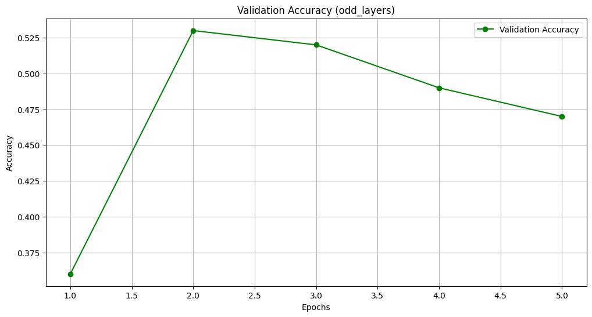

# Knowledge Distillation: Comparing Different Initialization Strategies

This project explores the effectiveness of knowledge distillation across various initialization strategies for student models, derived from a more complex teacher model. Through systematic experimentation, we assess how initializing student models with different layers (top, bottom, odd, even) from a pre-trained teacher model affects their learning capability and performance on a given task.

## Table of Contents
- [Overview](#overview)
- [Prerequisites](#prerequisites)
- [Installation](#installation)
- [Experiment Setup](#experiment-setup)
- [Key Findings](#key-findings)
- [Evaluation and Analysis](#evaluation-and-analysis)
  - [Impact of the initial layer selection](#impact-of-the-initial-layer-selection-top-k-layers-bottom-k-layers-odd-layers)
  - [Limitations and Challenges](#limitations-and-challenges)
  - [Proposed Improvements](#proposed-improvements)
- [Web Application Deployment](#web-application-deployment)
  - [Running the Application](#running-the-application)
- [Conclusion and Future Directions](#conclusion-and-future-directions)
- [Acknowledgements](#acknowledgements)


## Overview

Knowledge distillation involves transferring knowledge from a larger, more complex model (teacher) to a smaller, simpler model (student), aiming to retain the performance benefits of the larger model while reducing computational cost. This process is critical for deploying high-performing models in resource-constrained environments.
### Prerequisites

Ensure we have Python 3.x installed on system. Other key dependencies, we can install these packages via pip.

### Installation

To set up the environment and install the required dependencies for this project, follow these steps:

1. **Clone the Repository**: First, clone this repository to  local machine using Git:

```bash
git clone https://github.com/shaficse/distilBERT-Student-Layers-Initialization.git 
```

Install all required dependencies by running:

```bash
pip install -r requirements.txt
```
Model files are stored in [Google Drive Link](https://drive.google.com/drive/folders/1qYHjEy_D-LPemMTy3TcBgRyA8Yahl9He?usp=sharing)
## Experiment Setup

- **Dataset:** The experiments are conducted using a subset of the GLUE dataset, specifically focusing on a mismatched version for training, validation, and testing.

  - Subsequently, created smaller subsets of the train, validation, and test datasets by shuffling and selecting 1000, 100, and 100 examples each, respectively.
- **Teacher Model:** A pre-trained BERT model serves as the teacher, with its performance serving as a benchmark.
- **Student Models:** Derived from the teacher model, student models are initialized with half the number of layers, employing different strategies for selecting these layers:
  - **Top-K Layer:** Initializes with the first half of the layers from the teacher.
  - **Bottom-K Layer:** Initializes with the last half of the layers from the teacher.
  - **Odd Layer:** Initializes with every odd-numbered layer from the teacher.
  - **Even Layer:** Initializes with every even-numbered layer from the teacher.

## Key Findings

1. **Teacher Model Performance:** As expected, the teacher model outperforms all student models, demonstrating the value of depth and complexity in model architecture.

2. **Top-K Layer Strategy:** This strategy yielded the best performance among student models, indicating that the top layers of the teacher model capture more abstract, valuable features for the task.

3. **Bottom-K Layer Strategy:** This approach resulted in the lowest performance, suggesting that the bottom layers, while foundational, might not be sufficient on their own for complex tasks.

4. **Odd and Even Layer Strategies:** These strategies offered a middle ground in performance, with the even layer strategy slightly outperforming the odd layer strategy. This outcome underscores the importance of strategic layer selection in knowledge distillation.

## Evaluation and Analysis

### Impact of the initial layer selection (top K layers, bottom K layers, odd layers)
Summary and Analysis of Initial Layer Selection Impact on Performance:

| Student Layer   | Training Loss | Validation Loss | Validation Accuracy | Performance Impact |
|-----------------|---------------|-----------------|---------------------|-------------------|
| Top-K Layer     | 0.2823        | 0.9019          | 58.0000%            | Higher validation accuracy compared to other strategies, indicating that initializing with top layers captures more relevant information from the teacher model. However, higher validation loss suggests potential overfitting or complexity. |
| Bottom-K Layer  | 0.3603        | 1.1181          | 38.0000%            | Lower validation accuracy compared to other strategies, implying that initializing with bottom layers might not capture sufficient relevant information from the teacher model. Higher validation loss suggests either underfitting or inadequate model complexity. |
| Odd Layer       | 0.3042        | 0.9772          | 47.0000%            | Moderate validation accuracy and loss. Initializing with odd layers balances between capturing relevant information and model complexity, resulting in intermediate performance. |
| Even Layer      | 0.3144        | 1.0152          | 51.0000%            | Slightly better validation accuracy compared to odd layers but still lower than top-K layer. Initializing with even layers demonstrates performance between odd layers and top layers, suggesting a moderate capture of relevant information. |


 
 
 
 
 
 
 
 

Overall, the choice of initial layer selection significantly impacts the performance of the student model. The top-K layer initialization tends to perform best, likely due to capturing the most relevant information from the teacher model, while bottom-K layer initialization performs the worst. Odd and even layer initializations offer a balance between capturing relevant information and model complexity.


**Teacher Model Average Metric**: 0.636

### Limitations and Challenges:

1. **Interpretability of Initial Layer Selection**: While the results provide insights into the impact of different initialization strategies, interpreting why certain strategies perform better than others can be challenging. Understanding the underlying dynamics of layer selection and its interaction with model architecture is crucial but complex.

2. **Sensitivity to Hyperparameters**: The performance of student distillation is highly sensitive to hyperparameters such as learning rate, temperature, and batch size. Suboptimal hyperparameter choices can lead to subpar performance across all strategies.

3. **Overfitting and Underfitting**: Balancing between overfitting and underfitting during distillation is non-trivial. Strategies that initialize with fewer layers might underfit, while strategies with more layers might overfit, leading to a trade-off between capturing relevant information and model complexity.

### Proposed Improvements:

1. **Comprehensive Hyperparameter Search**: Conducting a systematic hyperparameter search to find optimal values for learning rate, temperature, and other parameters can enhance the performance of all strategies. Techniques such as grid search or random search can be employed for this purpose.

2. **Regularization Techniques**: Introducing regularization techniques like dropout or weight decay can help mitigate overfitting issues, especially for strategies that initialize with a larger number of layers.

3. **Dynamic Layer Initialization**: Rather than relying on static layer selection strategies (e.g., top-K, bottom-K), implementing dynamic layer initialization methods that adaptively select layers based on their relevance to the task can potentially improve performance.

4. **Ensemble of Student Models**: Instead of relying on a single student model, constructing an ensemble of student models initialized with different strategies and combining their predictions can lead to more robust and accurate results.

By addressing these limitations and incorporating proposed improvements, the student distillation process can be made more effective and robust, ultimately enhancing its ability to transfer knowledge from teacher to student models effectively.
## Web Application Deployment

A Flask application serves as the interface for model interaction. 
- Users can input **Query** and **Context(optional)** and adjust parameters like **temperature** and **max length** to influence the text generation. 

The application routes include a home page for input submission and a generate endpoint that returns the generated text.


### Running the Application

To start the Flask web application:

```bash
python app.py
```

    
Navigate to `http://127.0.0.1:5000/` in  web browser to interact with the application.


## Conclusion and Future Directions

The experiment highlights the significance of layer selection in the knowledge distillation process. While the top-k layer strategy emerged as the most effective, there is a nuanced balance between model size and performance that must be considered.

Future research might explore hybrid strategies or more granular layer selection mechanisms to optimize the efficiency and effectiveness of distilled models further.

## Acknowledgements

This project leverages the Hugging Face Transformers library for model architecture and the Datasets library for data handling, showcasing the practical application of these tools in conducting advanced machine learning research.
